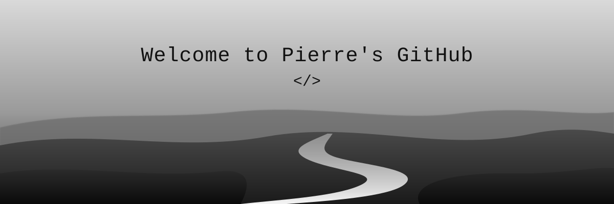

 

<!-- Ajoute tes liens ici, ex. :

-->

## 🧑‍🚀 About me

Hello there! I'm **Pierre Peuraud**, an apprentice developer in training based in **France** 🇫🇷.
I explore different languages and technologies to strengthen my skills and build increasingly interesting projects — from low-level systems in **C** and **Rust** to web apps with **TypeScript** and **Vue**.

🎓 **Apprentice developer** 
🦀 **Currently learning Rust** 
🌐 **Building web apps with Vue & TypeScript** 
💻 **Always looking for new projects**

 

## ⚙️ Technologies

## 📈 Statistics

  

